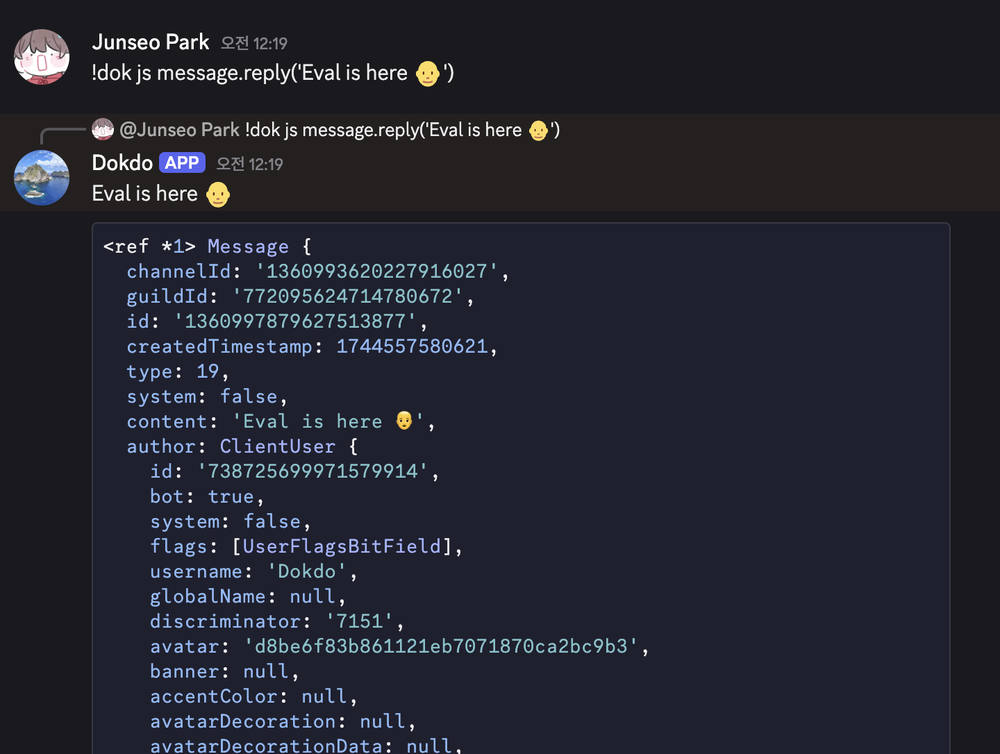
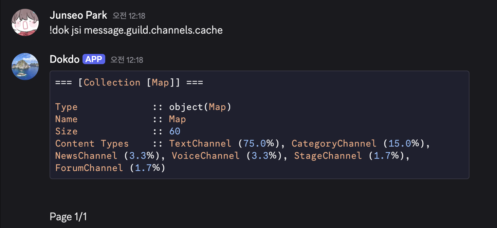
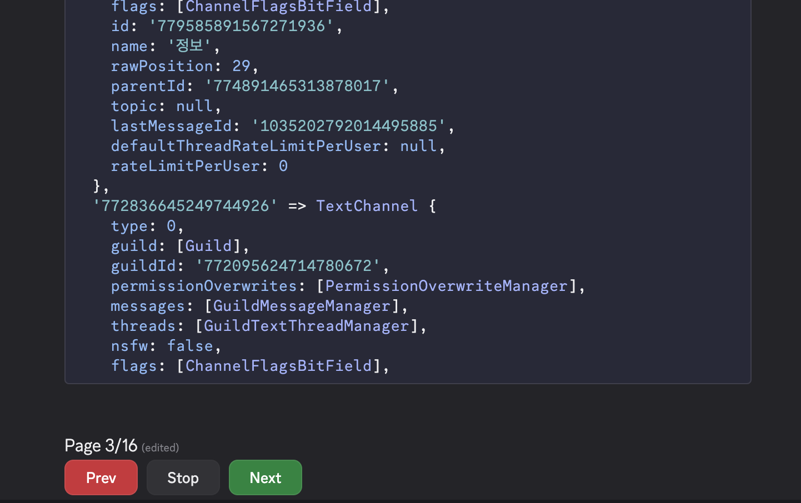
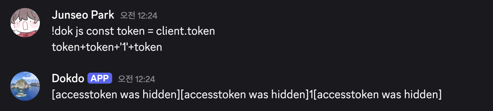

<div align="center">

<br/>
<p>
    <a href="https://npmjs.com/package/dokdo"></a>
    <a href="https://github.com/wonderlandpark/dokdo/actions"></a>
</p>
<p>
    <a href="https://nodei.co/npm/dokdo/"></a>
</p>
</div>

# Dokdo

**Dokdo** is a powerful, extensible debugging toolkit for `discord.js`.
It allows you to evaluate JavaScript code, run shell commands, and inspect your bot in real-time directly from Discord.

> Inspired by [Jishaku](https://github.com/scarletcafe/jishaku) for `discord.py`.

## ✨ Features

- **Eval Command** – Run JavaScript code directly in the context of your bot.



- **Shell Command** – Execute terminal commands through Discord. You could also abort running process.


- **Paginated Output** – Long outputs are automatically split and navigable via or buttons.


- **Security Protection** – Automatically masks bot tokens and other sensitive values from outputs.


- **Easy to Customize** – Tailor prefixes, aliases, owners, variables, and permission error messages etc to fit your needs.

## 🚀 Installation

Dokdo stable version requires Discord.js v14 or later.

```bash
npm install dokdo
```

<details>
    <summary>Using Discord.js v12?</summary>

You could install `dokdo@0.4.1` by
    
```sh
  npm i dokdo@djsv12
```
</details>

<details>
    <summary>Using Discord.js v13?</summary>

You could install `dokdo@0.5.1` by
    
```sh
  npm i dokdo@djsv13
```
</details>

<details>
  <summary>Nightly Version?</summary>

[Github Packages](https://github.com/wonderlandpark/dokdo/pkgs/npm/dokdo)
(registry configuration needed)

```sh
npm i @wonderlandpark/dokdo@nightly
```
</details>

## 🛠️ Usage

```js
const Discord = require('discord.js')
const client = new Discord.Client({ intents: ['GUILDS', 'GUILD_MESSAGES'] })

const Dokdo = require('dokdo')

const DokdoHandler = new Dokdo.Client(client, { aliases: ['dokdo', 'dok'], prefix: '!' }) // Using Bot Application ownerID as default for owner option.

client.on('messageCreate', async message => {
  if (message.content === 'ping') return message.channel.send('Pong') // handle commands first
  await DokdoHandler.run(message) // try !dokdo
})

client.login('super secret token')
```

## 📦 Command References

### `> dokdo [js|javascript] <argument>`
### `> dokdo [jsi|javascript_inspect] <arguemnt>`

Evaluate or execute JavaScript(Node.js) code passed.

Available Variables by default:

| VARIABLE  | DESCRIPTION |
|---|---|
| `client` | The bot `client(Discord.Client)` passed by `Dokdo.Client(client)` |
| `message` | The `message(Discord.Message)` passed by `DokdoHandler.run(message)` |
| `_dokdo` | The Dokdo Client |

### `> dokdo [exec||shell|sh|bash|ps|powershell|zsh] <argument>`

Executes commands at your system shell.

Dokdo detects your `SHELL` environment variable(process.env.SHELL) or uses powershell for Windows platform. You could abort running process by a Button.

The execution terminates automatically after 3 minutes.

### `> dokdo [cat] <argument>`

Reads a file from your file system. Pass your file path. (Ex: /home/dokdo/bot.js)

### `> dokdo [curl] <argument>`

Reads text of given URL.

### `> dokdo [shard] <argument>`

Executes commands on every sharded processes. (Discord.js Sharding)

## 🧾 Notes

### Message contents intent not approved?

You can set the Dokdo prefix including mentions. This allows the client to read the message content.

Example:

```js
new Dokdo.Client(client, {  prefix: '<@285185716240252929>' })
```
Command Usage: `<@285185716240252929>dokdo`

## 📚 Documentation

Full documentation, examples, and advanced usage: 

👉 https://dokdo.js.org

## 🤝 Contributing

Pull requests and issues are welcome. Dokdo is open-source and built with developer experience in mind. Please check [the contribution guide](./.github/CONTRIBUTING.md) before you submit Pull Request.
