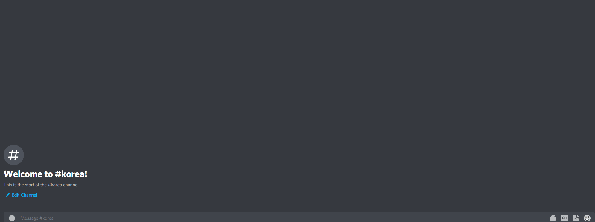
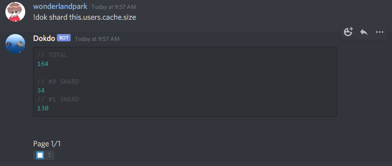

<div align="center">

<br/>
<p>
    <a href="https://npmjs.com/package/dokdo"></a>
    <a href="https://github.com/wonderlandpark/dokdo/actions"></a>
</p>
<p>
    <a href="https://nodei.co/npm/dokdo/"></a>
</p>
</div>

## About

Dokdo. Easy Discord bot debuging tool.

It's debugging tool for `discord.js` projects.

## Preview



## Installation

For now I recommend using Dev version.

### Stable

```sh
npm i dokdo@latest
```

### Dev

```sh
npm i wonderlandpark/dokdo#main
```

## Features

### Easy shard broadcastEval manager



## Example usage

```js
const Discord = require('discord.js')
const client = new Discord.Client()

const Dokdo = require('dokdo')

const DokdoHandler = new Dokdo(client, { aliases: ['dokdo', 'dok'], prefix: '!' }) // Using Bot Application ownerID as default for owner option.

client.on('message', async message => {
  if (message.content === 'ping') return message.channel.send('Pong') // handle commands first
  DokdoHandler.run(message) // try !dokdo
})

client.login('super secret token')
```

## Contributing

Please check out it hasn't already been exists before you create issue, and check [the contribution guide](./.github/CONTRIBUTING.md) before you submit Pull Request.
